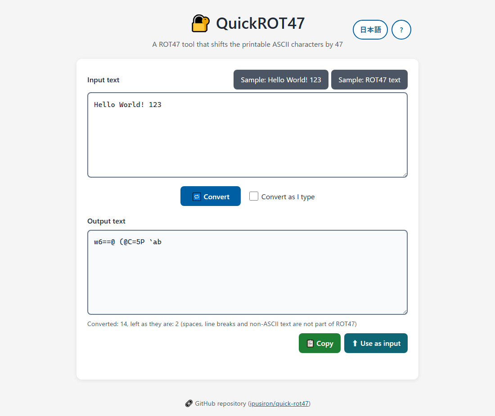

# QuickROT47 - ROT47 Encoder/Decoder

English · [日本語](README.md)


[](https://ipusiron.github.io/quick-rot47/)

**Day037 - 100 Security Tools with Generative AI**

**QuickROT47** is a simple web tool for trying ROT47, which rotates each printable ASCII character (codes 33-126) by 47 places, wrapping around after `~`.

One button takes you from plain text to ROT47 text and back. You can see for yourself that applying the same conversion twice gives the original text.
ROT47 has no key and provides no real security. This tool is made for learning how it works.

---

## 🔗 Demo

👉 [https://ipusiron.github.io/quick-rot47/](https://ipusiron.github.io/quick-rot47/)

---

## 📸 Screenshots

> 
>
> *"Hello World! 123" converted with ROT47*

> 
>
> *Full-width letters and digits are not converted, so the page shows a note (Japanese UI)*

---

## 🚀 Features

- ✅ Converts text with ROT47 in one click (converting the result again gives the original back)
- ✅ With "Convert as I type" on, the output follows the input as you type
- ✅ Two samples: plain text and ROT47 text
- ✅ Shows how many characters were converted and how many were left as they are (spaces, line breaks, non-ASCII text and so on)
- ✅ Tells you when full-width letters, digits or symbols are mixed in, because ROT47 does not convert them
- ✅ Copies the output (if the page cannot copy, it selects the output and tells you how to copy it by hand)
- ✅ Moves the output into the input and converts it again in one click
- ✅ Japanese and English UI (button at the top of the page)
- ✅ Nothing you type is sent anywhere (everything runs in the browser)

---

## 🧭 How to Use

1. Type text into the input (or use a sample button)
2. Press "Convert"
3. Copy the output. "Use as input" moves the output into the input and converts it again (the output goes back to the original text)

The "?" button at the top of the page opens the help dialog.

---

## 🧪 What Is ROT47?

ROT47 rotates each of the 94 printable ASCII characters by 47 places around a ring of 94.
Unlike ROT13, which handles letters only, it also converts digits and symbols.

**Applying the same conversion again** to the result gives the original text, so one button both converts and restores.

### The 94 pairs

Each character in the top row swaps with the one below it (for example `A` and `p`, `1` and `` ` ``).

```
!"#$%&'()*+,-./0123456789:;<=>?@ABCDEFGHIJKLMNO
PQRSTUVWXYZ[\]^_`abcdefghijklmnopqrstuvwxyz{|}~
```

### ⚠️ Not encryption

ROT47 has no key. Anyone who knows it can undo it by applying it again.
OWASP describes encodings such as Base64 as "not a security control", and ROT47 is no different.

The following uses only change how the data looks. They do not protect it.

- Hiding passwords or API keys in configuration files with ROT47 is not protection. Covering a password with a trivial encoding is a recognized weakness (CWE-261, Weak Encoding for Password). Keep secrets in a secrets manager, or encrypt them with a key.
- "Masking" personal data in logs with ROT47 is not protection either. ROT47 converts only printable ASCII characters, so names written in kanji or kana stay readable. Leave such data out of logs, or remove, mask, hash or encrypt it (OWASP Logging Cheat Sheet).
- Covering debug information with ROT47 is not protection. Remove it before release (CWE-215, CWE-532).

ROT47 is useful only as a thin veil, for example to keep a spoiler from being read by accident.

---

## 📊 ASCII: Printable and Non-printable Characters

### The ASCII code

ASCII (American Standard Code for Information Interchange) is a 7-bit character code for representing text on computers. It defines 128 characters, 0 to 127.

### Character classes

| Class | Code range | Count | What they are | Examples |
|-------|------------|-------|---------------|----------|
| **Control characters (non-printable)** | 0-31 | 32 | Characters for control, not shown on screen | NUL(0), TAB(9), LF(10), CR(13) |
| **Space** | 32 | 1 | Separates words; sometimes counted as printable, but it has no visible shape | SP(32) |
| **Printable characters** | 33-126 | 94 | Characters shown on screen | !, ", #, $, %, A, B, 1, 2 and so on |
| **Delete (non-printable)** | 127 | 1 | The delete control character | DEL(127) |

### What ROT47 converts

ROT47 converts only the **94 printable ASCII characters (33-126)**:

```
! " # $ % & ' ( ) * + , - . /  ← symbols (33-47)
0 1 2 3 4 5 6 7 8 9            ← digits (48-57)
: ; < = > ? @                  ← symbols (58-64)
A B C D E F G H I J K L M N O  ← uppercase letters (65-79)
P Q R S T U V W X Y Z          ← uppercase letters (80-90)
[ \ ] ^ _ `                    ← symbols (91-96)
a b c d e f g h i j k l m n o  ← lowercase letters (97-111)
p q r s t u v w x y z          ← lowercase letters (112-122)
{ | } ~                        ← symbols (123-126)
```

### Why only printable characters

1. **Line breaks and tabs stay**: control characters such as line feeds (LF) and tabs (TAB) are not converted, so the lines and indentation of the text are kept
2. **Files do not break**: converting control characters could corrupt files or cause unexpected behavior
3. **The result stays printable**: the output is made of printable characters only, so any editor can show and edit it

### Example

These two lines (with a tab between "2" and "Tab" on the second line):

```
Hello World!
Line 2	Tab
```

become this after ROT47:

```
w6==@ (@C=5P
{:?6 a	%23
```

- The line break (between the first and second lines) stays
- The tab (between "2" and "Tab") stays
- Only printable characters are converted

### Full-width and Japanese text

Full-width letters, digits and symbols (such as "Ａ", "１" and "！") are different characters from ASCII. ROT47 does not convert them.
Japanese characters and emoji are not converted either.

When full-width letters, digits or symbols are mixed into the input, the tool shows a note with how many there are.
If you want them converted, change them to half-width characters before you type them in.

---

## 🔄 ROT13 and ROT47 Compared

| Feature | ROT13 | ROT47 |
|---------|-------|-------|
| **Characters** | Letters only (A-Z, a-z) | All printable ASCII (33-126) |
| **How many** | 26 | 94 (symbols, digits, letters) |
| **Shift** | 13 | 47 |
| **Digits** | ❌ Not converted | ✅ Converted |
| **Symbols** | ❌ Not converted | ✅ Converted |
| **Uppercase and lowercase** | Uppercase stays uppercase, lowercase stays lowercase | Not kept (`A`→`p`, `a`→`2`, `P`→`!`) |
| **Japanese and full-width text** | Not converted | Not converted |
| **Reversible** | ✅ Applying it twice restores the text | ✅ Applying it twice restores the text |

### Examples

| Input | ROT13 | ROT47 |
| --- | --- | --- |
| `` Hello World! 123 `` | `` Uryyb Jbeyq! 123 `` | `` w6==@ (@C=5P `ab `` |
| `` The Quick Brown Fox `` | `` Gur Dhvpx Oebja Sbk `` | `` %96 "F:4< qC@H? u@I `` |
| `` Answer: 42 `` | `` Nafjre: 42 `` | `` p?DH6Ci ca `` |
| `` https://example.com/?q=1 `` | `` uggcf://rknzcyr.pbz/?d=1 `` | `` 9EEADi^^6I2>A=6]4@>^nBl` `` |

ROT13 leaves digits, symbols and the shape of a URL as they are. ROT47 makes them unreadable too.

### Which one to use

- **ROT13**: for English text when you want digits, symbols and URLs to keep their shape
- **ROT47**: when you want digits and symbols hidden from a casual glance as well (Japanese and full-width text still stay as they are)

---

## 🔬 Why Applying It Twice Restores the Text (Technical Notes)

ROT47 undoes itself because **47 is exactly half of 94**.

### The math

There are 94 printable ASCII characters (codes 33-126). ROT47 moves each one 47 places around a ring of 94 characters:

```
First pass:  character X -> (X - 33 + 47) mod 94 + 33 = Y
Second pass: character Y -> (Y - 33 + 47) mod 94 + 33 = X
```

### A worked example

Converting the letter "A" (ASCII code 65) twice:

```
First pass: 'A' (65)
  Position from the first character (!): 65 - 33 = 32
  Shifted position: (32 + 47) mod 94 = 79
  Code: 79 + 33 = 112 -> 'p'

Second pass: 'p' (112)
  Position from the first character (!): 112 - 33 = 79
  Shifted position: (79 + 47) mod 94 = 126 mod 94 = 32
  Code: 32 + 33 = 65 -> 'A' (the original)
```

### Why 47

- On a ring of 94 characters, 94 ÷ 2 = 47
- A shift of 47 is exactly half a turn around the ring
- 47 × 2 = 94, and 94 mod 94 = 0, so you are back where you started
- So converting and restoring are the same operation (self-inverse)

### A picture of it

Think of a clock face. Going from 12 to 6 is half a turn; going on from 6 to 12 is another half, and you are back at 12. ROT47 works the same way: two half turns of 47 around the ring of 94 make one full turn.

This makes ROT47 an **involution**: the same operation converts and restores.

---

## 🌍 Where ROT47 Comes From and How It Is Used

### Origin of the name

The earliest surviving record of the name ROT47 is a post to fj.kanji, a newsgroup on JUNET, the Japanese netnews network, in July 1987 (dated 23 July, GMT).
Applying ROT13 to a kanji article of the time changed only the kanji bytes that happened to fall in the range of Latin letters, so the text could still be roughly guessed. In that post, Toshikazu Wada of Tokyo Institute of Technology presented "ROT47", a method suggested by Akinori Saitoh of Osaka University (affiliations as of 1987): rotate the 94 byte values 0x21-0x7E by 47. Both bytes of a JIS kanji fall in 0x21-0x7E, so rotating each byte by 47 turns most level-1 kanji into level-2 kanji, and the text becomes unreadable at a glance.
Two days later Saitoh added the conversion to jnews, a newsreader he had been modifying. His formula is the same as today's ROT47. The intended use was the same as ROT13's: hiding jokes and spoilers.
In September 1987, "ROT13/47" was proposed: ROT13 for Latin letters and ROT47 for JIS kanji. That scheme survives as the `-r` option of nkf, a Japanese character-code converter.
Primary sources do not show when people began applying ROT47 to text made only of ASCII letters, digits and symbols, which is how it is used today.

### ROT13 and hiding spoilers

From the early 1980s, ROT13 was used on Usenet (for example in net.jokes) to hide jokes some readers might find offensive, puzzle answers and spoilers, so that each reader could choose whether to decode them.
ROT47 can serve as the same kind of veil, but the spoiler-hiding custom belongs to ROT13.
Today's Reddit and Discord have built-in spoiler markup (Reddit: `>!...!<`, Discord: `||...||`).

### Geocaching

Geocaching.com encrypts cache hints with ROT13. Its official glossary says "Hints for geocaches are encrypted using ROT13."
ROT47 appears inside some puzzle (Mystery) caches, where the owner uses it as part of the challenge. For example, GC4ZVTF "Crypto #2 - ROT47" in France gives its final coordinates in ROT47. Because ROT47 also converts digits and symbols, it can hide strings that contain numbers, such as coordinates.

### CTF (Capture The Flag)

ROT47 appears in entry-level CTF challenges, for example SunshineCTF 2019 "WelcomeCrypto" (Crypto, 50 points) and picoCTF 2021 "crackme-py" (Reverse Engineering, 30 points).
Because it also rotates digits and symbols, its output is harder to read at a glance than ROT13's. It has no key, though, so once you recognize it, undoing it takes a moment.

### Learning and puzzles

- A teaching aid for the basics of ciphers (substitution, self-inverse functions, character codes)
- A good programming exercise (a few lines, easy to test)
- Hints for ARGs (alternate reality games) and escape games

### Sources

- [Archive of old fj.kanji articles](https://ie.u-ryukyu.ac.jp/~kono/fj/fj.kanji/) (University of the Ryukyus): the ROT47 and ROT13/47 discussion of July-September 1987 (Japanese)
- [nkf manual](https://manpages.ubuntu.com/manpages/jammy/man1/nkf.1.html): the `-r` option (ROT13/47)
- [Wikipedia: ROT13](https://en.wikipedia.org/wiki/ROT13): ROT13 on Usenet; ROT5, ROT18 and ROT47
- [Geocaching Glossary](https://www.geocaching.com/about/glossary.aspx): hints are encrypted with ROT13
- [GC4ZVTF "Crypto #2 - ROT47"](https://www.geocaching.com/geocache/GC4ZVTF_crypto-2-rot47): a Mystery cache that uses ROT47
- [SunshineCTF 2019 "WelcomeCrypto" writeup](https://ctftime.org/writeup/14258), [picoCTF 2021 "crackme-py" writeup](https://github.com/evyatar9/Writeups/blob/master/CTFs/2021-picoCTF2021/crackme-py/README.md)
- [OWASP Security Terminology Cheat Sheet](https://cheatsheetseries.owasp.org/cheatsheets/Security_Terminology_Cheat_Sheet.html), [OWASP Logging Cheat Sheet](https://cheatsheetseries.owasp.org/cheatsheets/Logging_Cheat_Sheet.html)
- [CWE-261: Weak Encoding for Password](https://cwe.mitre.org/data/definitions/261.html), [CWE-215](https://cwe.mitre.org/data/definitions/215.html), [CWE-532](https://cwe.mitre.org/data/definitions/532.html)
- [rottytooth/rot8000](https://github.com/rottytooth/rot8000): the ROT8000 reference implementation

---

## 🔢 Relatives of ROT13 and ROT47

### ROT for digits

| Name | Characters | Shift | Notes |
|------|------------|-------|-------|
| **ROT5** | Digits only (0-9) | 5 | Half a turn of a ring of 10, so applying it twice restores the input |
| **ROT18** | Letters and digits | 13 for letters, 5 for digits | ROT13 on letters plus ROT5 on digits (18 = 13 + 5). Also called ROT13.5 |

### Substitutions by character range

| Name | Characters | Notes |
|------|------------|-------|
| **Atbash** | Hebrew or Latin letters | Maps the alphabet onto its reverse (A↔Z, B↔Y). Originally used with the Hebrew alphabet |
| **Caesar cipher** | Letters | The general scheme of shifting each letter by a fixed number of places (ROT is a special case). Caesar himself reportedly used a shift of 3 |

### Unusual ROT variants

1. **ROT8000**
   - ROT13 extended to Unicode's Basic Multilingual Plane (BMP, U+0000-U+FFFF)
   - Created by the artist and programmer Daniel Temkin, and put online in November 2013 for The Wrong, an online digital art biennale. The name refers to 0x8000, half the BMP, and the example on the original 2013 info page shifted every character by exactly 0x8000
   - The current reference implementation (rottytooth/rot8000) lists the 63,404 BMP code points that are not control characters, whitespace or surrogates, and shifts by half that count, 31,702 places. So the shift is slightly less than 0x8000, and the output differs from the 2013 version
   - Both versions restore the input when applied twice. With the current version, English text comes out looking like a run of CJK ideographs with the bamboo or rice radical. Kana maps to Hangul, and CJK ideographs often land in Hangul or the Private Use Area (often unprintable)

2. **ROT-N (variable)**
   - The user chooses the shift
   - The same idea as the Caesar cipher
   - The shift can be seen as a key, but for letters there are only 25 choices, so trying them all breaks it at once

3. **ROT13/47**
   - ROT13 on Latin letters and ROT47 on JIS kanji (see "Origin of the name")
   - Still available as the `-r` option of nkf, a Japanese character-code converter

### Comparison

| Scheme | Reversible | Security | Effort to implement | Typical use |
|--------|------------|----------|---------------------|-------------|
| ROT13 | ✅ Self-inverse | Very low | Very easy | Hiding spoilers |
| ROT47 | ✅ Self-inverse | Very low | Very easy | Entry-level CTF challenges, puzzles |
| ROT5 | ✅ Self-inverse | Very low | Very easy | Hiding digits from a glance |
| Atbash | ✅ Self-inverse | Very low | Easy | Learning classical ciphers |
| Caesar cipher | ⚠️ Restoring needs the shift | Low | Easy | First steps in cryptography |
| ROT8000 | ✅ Self-inverse | Very low | Somewhat harder | Experiments and art |

### Where ROT47 stands

1. **Converts more than ROT13**
   - Digits and symbols are converted too
   - It stays within ASCII and takes a few lines to implement
2. **Easy to handle**
   - The output is printable ASCII as well, so it rarely gets garbled
   - Any text editor can handle it
3. **Support in tools**
   - Known as a ROT13 derivative. Many tools, such as CyberChef, offer ROT47 next to ROT13
   - It is less widespread than ROT13. The standard libraries of Python and PHP include ROT13 only

---

## 📂 Directory Structure

```
quick-rot47/
├── .github/                # GitHub settings
│   └── workflows/          # GitHub Actions workflows
│       └── test.yml        # Runs npm test on push and pull_request
├── assets/                 # Images
│   ├── en/                 # Screenshots of the English UI
│   │   └── screenshot.png  # The sample converted in the English UI
│   ├── screenshot.png      # The sample converted in the Japanese UI
│   └── screenshot2.png     # Text with full-width letters and digits, and the note
├── js/                     # Scripts (classic scripts)
│   ├── i18n.js             # Japanese and English messages, language switching
│   ├── main.js             # Conversion, samples, copying and help on the page
│   └── rot-core.js         # ROT47 and the character counts (no DOM)
├── test/                   # Automated tests (node --test)
│   ├── contrast.test.js    # Color contrast ratios
│   ├── core.test.js        # Worked-out examples, self-inverse property and counts
│   ├── format.test.js      # Line lengths, control characters and line counts
│   ├── html.test.js        # CSP, ARIA and patterns the scripts must not use
│   ├── i18n.test.js        # Japanese and English messages
│   └── readme.test.js      # README examples, structure and images
├── .gitignore              # Files ignored by Git
├── .nojekyll               # Disables Jekyll on GitHub Pages
├── CLAUDE.md               # Notes for Claude Code (English)
├── LICENSE                 # MIT license
├── README.en.md            # English README
├── README.md               # Japanese README
├── index.html              # The page
├── package.json            # npm test configuration (no dependencies)
└── style.css               # Page styles (colors in :root variables)
```

---

## ⚙️ Specification

### The page

| Element | Description |
|---------|-------------|
| **Input text** | A multi-line input. The sample buttons fill in plain text or ROT47 text |
| **Convert** | Converts the input with ROT47 and puts the result in the output |
| **Convert as I type** | When on, the output follows the input as you type |
| **Output text** | The result (read-only). Below it, the counts of converted characters and characters left as they are |
| **Copy** | Copies the output to the clipboard. If the page cannot copy, it selects the output and tells you how to copy it by hand |
| **Use as input** | Moves the output into the input and converts it again at once (the output goes back to the original text) |
| **Status** | Shows the result of an action for 4 seconds (also read out by screen readers) |
| **Help (?)** | Explains how ROT47 works, how to use the tool and what to watch out for |
| **Language button** | Switches between Japanese and English. The choice is saved in the browser |

### Technology

| Item | Details |
|------|---------|
| **Front end** | HTML, CSS and JavaScript (no libraries, no build step) |
| **Scripts** | Classic scripts. The core (`js/rot-core.js`) does not use the DOM, so the Node.js tests load it too |
| **CSP** | Based on `default-src 'none'`, allowing only the page's own scripts, styles and images (including the data: favicon). The page makes no outside connections |
| **Clipboard** | Uses `navigator.clipboard.writeText`. If the page cannot copy, it selects the output and tells you how to copy it by hand |
| **What is saved** | Only the display language (`localStorage`). The page works where storage is blocked |
| **Language choice** | `?lang=ja` or `?lang=en` in the URL, then the saved language, then the browser language |
| **Responsive layout** | Spacing and layout change at 640px and 480px. Buttons are at least 44px high |
| **Tests** | `npm test` (`node --test`). No dependencies |

### Colors

| Element | Color |
|---------|-------|
| Main color (convert button, header buttons, help headings, links) | `#005fa3` (`--primary`) |
| Convert button on hover | `#004a80` (`--primary-dark`) |
| Copy button and status messages | `#1e7e34` (`--ok`) |
| "Use as input" button | `#0e6674` (`--set`) |
| Sample buttons | `#4b5563` (`--sample`) |
| Body text | `#1f2937` (`--text`) |
| Secondary text (subtitle, counts, footer) | `#4b5563` (`--muted`) |
| Warning text (full-width note) | `#854d0e` (`--warn-text`) |
| Keyboard focus outline | `#005fa3` (`--focus`) |

Every text color has a contrast ratio of at least 4.5:1 against its background (checked by `test/contrast.test.js`).

---

## 🧪 Tests

```bash
npm test
```

The tests check the following. GitHub Actions runs them on every push and pull request.

- ROT47 results match examples worked out by hand
- The mapping of the 94 characters is self-inverse
- The Japanese and English messages have the same keys
- The CSP stays strict, and the scripts use no `innerHTML`, inline scripts and the like
- The color contrast ratios
- The examples, pair table and worked example in the READMEs match the core

---

## Related Resources

### Tools (ones I worked on)

- [ROT13 Encoder](https://ipusiron.github.io/rot13-encoder/)

---

## 📄 License

MIT License. See [LICENSE](LICENSE) for details.

---

## 🛠 About This Tool

This tool was made as part of the "100 Security Tools with Generative AI" project, in which a variety of security-related tools are built with the help of AI and published over 100 days.

For more about the project and the other tools, see the page below (Japanese).

🔗 [https://akademeia.info/?page_id=42163](https://akademeia.info/?page_id=42163)
