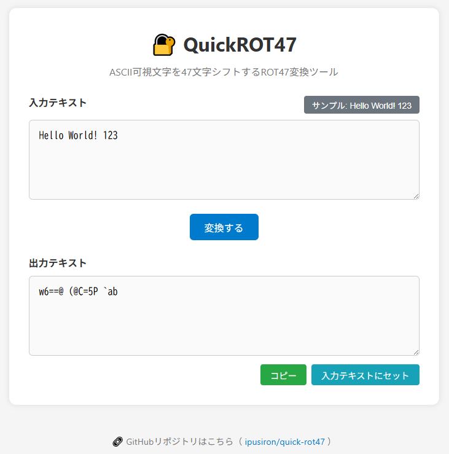

# QuickROT47 - ROT47変換ツール


[](https://ipusiron.github.io/quick-rot47/)

**Day037 - 生成AIで作るセキュリティツール100**

**QuickROT47** は、ASCII可視文字（33〜126）を対象に47文字分ずらして変換する軽量暗号方式「ROT47」を、即座に体験できるシンプルなWebツールです。

平文・暗号文の相互変換をボタン1つで実行でき、教育用・学習用・デモンストレーション用として活用できます。

---

## 🚀 特徴

- ✅ ROT47による暗号化／復号をワンクリックで体験
- ✅ 入力欄・出力欄のシンプルな2カラム構成
- ✅ 複数行入力対応（メモや文章も変換可）
- ✅ コピー用ボタンつき

---

## 🌐 デモページ

👉 [https://ipusiron.github.io/quick-rot47/](https://ipusiron.github.io/quick-rot47/)

---

## 📸 スクリーンショット

>   
>
> *"Hello World! 123"をROT47でエンコードした結果*

---

## 🧪 ROT47とは？

ROT47は、ASCII文字（表示可能な範囲）を47文字分ローテーションさせて変換する簡易暗号方式です。
英字・数字・記号を含むため、ROT13よりも広範な文字を対象とできます。

暗号化も復号も**同じ処理をもう一度実行**することで元に戻ります。

---

## 📊 ASCII文字と可視文字・不可視文字

### ASCII文字コード体系

ASCII（American Standard Code for Information Interchange）は、コンピューターで文字を表現するための7ビット文字コード体系です。0〜127の128個の文字を定義しています。

### 文字の分類

| 分類 | コード範囲 | 文字数 | 内容 | 例 |
|------|------------|--------|------|-----|
| **制御文字（不可視）** | 0-31 | 32個 | 画面に表示されない制御用文字 | NUL(0), TAB(9), LF(10), CR(13) |
| **空白文字** | 32 | 1個 | スペース（可視/不可視の境界） | SP(32) |
| **可視文字** | 33-126 | 94個 | 画面に表示される文字 | !, ", #, $, %, A, B, 1, 2, など |
| **削除文字（不可視）** | 127 | 1個 | 削除制御文字 | DEL(127) |

### ROT47が対象とする範囲

ROT47は**ASCII可視文字（33〜126）の94文字**のみを対象とします：

```
! " # $ % & ' ( ) * + , - . /  ← 記号（33-47）
0 1 2 3 4 5 6 7 8 9            ← 数字（48-57）
: ; < = > ? @                  ← 記号（58-64）
A B C D E F G H I J K L M N O  ← 大文字（65-79）
P Q R S T U V W X Y Z          ← 大文字（80-90）
[ \ ] ^ _ `                    ← 記号（91-96）
a b c d e f g h i j k l m n o  ← 小文字（97-111）
p q r s t u v w x y z          ← 小文字（112-122）
{ | } ~                        ← 記号（123-126）
```

### なぜ可視文字のみを対象とするのか？

1. **改行やタブを保持**: 改行（LF）やタブ（TAB）などの制御文字は変換されないため、テキストの構造が保持される
2. **安全性**: 制御文字を変換すると、ファイルが壊れたり、予期しない動作を引き起こす可能性がある
3. **可読性**: 変換結果も可視文字のみで構成されるため、どのエディターでも表示・編集可能

### 具体例

入力テキスト:
```
Hello World!
Line 2	Tab
```

ROT47変換後:
```
w6==@ (@C=5P
{:?6 a	%23
```

- 改行（Line 1とLine 2の間）は保持される
- タブ文字（"2"と"Tab"の間）も保持される
- 可視文字のみが変換される

---

## 🔄 ROT13 vs. ROT47 比較

| 特徴 | ROT13 | ROT47 |
|------|-------|-------|
| **対象文字** | 英字のみ（A-Z, a-z） | ASCII可視文字すべて（33-126） |
| **文字数** | 26文字（アルファベット） | 94文字（記号・数字・英字） |
| **シフト数** | 13文字 | 47文字 |
| **数字の変換** | ❌ 変換されない | ✅ 変換される |
| **記号の変換** | ❌ 変換されない | ✅ 変換される |
| **大文字小文字** | 保持される | 保持される |
| **用途** | 英文のネタバレ防止など | より幅広い文字の難読化 |
| **可逆性** | ✅ 2回適用で元に戻る | ✅ 2回適用で元に戻る |

### 変換例

#### ROT13の例
- 入力: "Hello World! 123"
- 出力: "Uryyb Jbeyq! 123"（数字・記号は変換されない）

#### ROT47の例
- 入力: "Hello World! 123"
- 出力: "w6==@ (@C=5P `ab"（すべての可視文字が変換される）
  - スクリーンショットを参照。

### 使い分けのポイント

- **ROT13**: 英文のみを扱い、URLや数値データを保持したい場合
- **ROT47**: 記号や数字も含めて完全に難読化したい場合

---

## 🔬 なぜ2回適用で元に戻るのか？（技術的解説）

ROT47が2回の適用で元の文字に戻る理由は、**47が94の正確に半分**であることに起因します。

### 数学的な仕組み

ASCII可視文字の範囲は94文字（コード33〜126）です。ROT47では各文字を47文字分シフトします：

```
1回目の変換: 文字X → (X - 33 + 47) mod 94 + 33 = Y
2回目の変換: 文字Y → (Y - 33 + 47) mod 94 + 33 = X
```

### 具体例で理解する

文字 'A'（ASCII: 65）を変換する場合：

```
1回目: 
  - 基準点からの位置: 65 - 33 = 32
  - シフト後: (32 + 47) mod 94 = 79
  - ASCII値: 79 + 33 = 112 → 'p'

2回目:
  - 基準点からの位置: 112 - 33 = 79  
  - シフト後: (79 + 47) mod 94 = 126 mod 94 = 32
  - ASCII値: 32 + 33 = 65 → 'A'（元に戻る）
```

### なぜ47なのか？

- 94文字の範囲で、94 ÷ 2 = 47
- 47文字シフトは、円環上でちょうど「半周」の移動
- 47 × 2 = 94となり、94 mod 94 = 0で元の位置に戻る
- これにより、暗号化と復号が同じ操作で実現できる（自己逆変換）

### 視覚的イメージ

時計の文字盤を想像してください。12時から6時（半周）進んで、さらに6時から12時（もう半周）進むと元の位置に戻ります。ROT47も同じ原理で、94文字の円環上を47文字（半周）ずつ2回移動すると、ちょうど1周して元の位置に戻ります。

この性質により、ROT47は**自己逆変換（involution）**の性質を持ち、同じアルゴリズムで暗号化も復号も行えるシンプルで美しい変換方式となっています。

---

## 🌍 ROT47の応用例と実際の活用

### 実際に活用されている例

1. **オンラインフォーラムでのネタバレ防止**
   - 映画やゲームのスポイラー情報を投稿する際に使用
   - 読みたい人だけがデコードして読める仕組み
   - RedditやDiscordなどで時折見かける手法

2. **Geocaching（ジオキャッシング）**
   - GPS座標や宝探しのヒントを難読化
   - パズルキャッシュの一部として使用
   - 簡単すぎず難しすぎない適度な難易度として人気

3. **CTF（Capture The Flag）競技**
   - 初級レベルの暗号問題として出題
   - 他の暗号と組み合わせた多段階暗号の一部
   - ステガノグラフィーと組み合わせた問題

4. **Usenetニュースグループ**
   - 歴史的にスポイラーやジョークの隠蔽に使用
   - alt.folklore.computers等での伝統的な慣習
   - ROT13と同様の文化的背景を持つ

5. **技術文書のイースターエッグ**
   - ソースコードのコメント内に隠しメッセージ
   - READMEファイルの末尾にジョークを埋め込む
   - 開発者間の内輪ネタの共有

### 現代的な応用例

1. **教育・学習ツール**
   - 暗号の基礎概念を教える教材
   - プログラミング演習の題材
   - セキュリティ意識向上のデモンストレーション

2. **簡易的な難読化**
   - 設定ファイル内の軽微な情報隠蔽
   - ログファイル内の個人情報の一時的マスキング
   - デバッグ情報の軽量な保護

3. **ゲーミフィケーション**
   - ARG（代替現実ゲーム）のパズル要素
   - 脱出ゲームのヒント提供
   - オンラインパズルの一部

---

## 🔢 ROT13・ROT47以外の類似暗号

### 数字ベースのROT暗号

| 名称 | 対象文字 | シフト数 | 特徴 |
|------|----------|----------|------|
| **ROT5** | 数字のみ（0-9） | 5文字 | 数字を半分シフト、2回で元に戻る |
| **ROT18** | 英字+数字 | ROT13+ROT5 | アルファベットと数字を同時に変換 |

### 文字範囲別のROT暗号

| 名称 | 対象範囲 | 用途 |
|------|----------|------|
| **Atbash** | ヘブライ文字/英字 | アルファベットを逆順に置換（A↔Z, B↔Y） |
| **Caesar Cipher** | 任意の文字 | シフト数を自由に設定可能（ROTの一般形） |

### 特殊なROT変種

1. **ROT8000**
   - Unicode基本多言語面（BMP）全体を対象
   - 0x8000（32768）文字分シフト
   - 日本語・中国語・韓国語なども変換可能
   - 実用性は低いが概念実証として興味深い

2. **ROTn（可変）**
   - ユーザーがシフト数を指定
   - 古典的なシーザー暗号の現代版
   - パスワード的な要素として鍵（シフト数）を使用

3. **複合ROT**
   - 文字種ごとに異なるROTを適用
   - 例：大文字はROT13、小文字はROT5、数字はROT47
   - より複雑な難読化を実現

### 比較表

| 暗号方式 | 可逆性 | 安全性 | 実装難易度 | 実用例 |
|----------|--------|--------|------------|--------|
| ROT13 | ✅ 自己逆変換 | 極低 | 極簡単 | ネタバレ防止 |
| ROT47 | ✅ 自己逆変換 | 極低 | 極簡単 | フォーラム投稿 |
| ROT5 | ✅ 自己逆変換 | 極低 | 極簡単 | 数字の難読化 |
| Atbash | ✅ 自己逆変換 | 極低 | 簡単 | 古典暗号学習 |
| Caesar | ⚠️ 鍵が必要 | 低 | 簡単 | 暗号入門 |
| ROT8000 | ✅ 自己逆変換 | 極低 | 中程度 | 実験的使用 |

### なぜROT47が選ばれるのか

1. **バランスの良さ**
   - ROT13より多くの文字を変換（記号・数字も含む）
   - ROT8000のような過度な複雑さがない
   - ASCII範囲内で完結し、実装が簡単

2. **互換性**
   - どのシステムでも動作
   - 文字化けのリスクが低い
   - テキストエディターで扱いやすい

3. **文化的認知**
   - ROT13に次いで知名度が高い
   - オンラインツールが豊富
   - コミュニティでの共通理解

---

## 📂 ディレクトリー構成

```
quick-rot47/
├── index.html        # メインHTML（UIレイアウト）
├── style.css         # スタイル定義（レスポンシブ対応）
├── script.js         # ROT47変換処理・UI操作
├── CLAUDE.md         # Claude Code用プロジェクト情報
├── LICENSE           # MITライセンス
├── README.md         # プロジェクト説明（このファイル）
└── assets/
    └── screenshot.png # スクリーンショット画像
```

---

## ⚙️ 現在のツール仕様（v1.5）

### 基本機能

| 項目 | 仕様 |
|------|------|
| **ツール名** | QuickROT47 |
| **タイトル** | 🔐 QuickROT47 - ROT47変換ツール |
| **変換アルゴリズム** | ASCII可視文字（33-126）を47文字シフト |
| **入力** | `<textarea id="inputText">` 複数行対応 |
| **出力** | `<textarea id="outputText" readonly>` 結果表示専用 |
| **プレースホルダー** | "ここに平文または暗号文を入力..." |

### UI構成・操作

| 要素 | 説明 |
|------|------|
| **サンプルボタン** | 入力欄右上、"Hello World! 123"を自動入力 |
| **変換ボタン** | 中央配置、入力テキストをROT47変換 |
| **コピーボタン** | 出力欄下・右側、結果をクリップボードにコピー |
| **セットボタン** | 出力欄下・右側、出力を入力欄にセット |
| **トースト通知** | ボタン操作時に一時的な成功メッセージ表示 |

### 技術仕様

| 項目 | 詳細 |
|------|------|
| **フロントエンド** | HTML5 + CSS3 + Vanilla JavaScript |
| **レスポンシブ対応** | モバイル（480px）・タブレット（768px）対応 |
| **ブラウザ対応** | モダンブラウザ + 古いブラウザフォールバック |
| **クリップボードAPI** | navigator.clipboard + document.execCommand併用 |
| **依存関係** | なし（純粋なHTML/CSS/JS） |

### スタイリング

| 要素 | スタイル |
|------|----------|
| **メインカラー** | #007acc（青系） |
| **コピーボタン** | #28a745（緑系） |
| **セットボタン** | #17a2b8（水色系） |
| **サンプルボタン** | #6c757d（グレー系） |
| **背景** | #f5f5f5（ライトグレー） |
| **コンテナー** | 最大幅700px、中央寄せ、角丸、シャドウ |

### 機能詳細

#### 1. ROT47変換処理
```javascript
// ASCII 33-126の範囲で47文字シフト
return String.fromCharCode(33 + ((code - 33 + 47) % 94));
```

#### 2. UI操作機能
- **setSampleText()**: サンプルテキスト自動入力
- **convertText()**: ROT47変換実行
- **copyResult()**: クリップボードコピー（トースト表示）
- **setToInput()**: 出力→入力への転送（トースト表示）

#### 3. レスポンシブ動作
- タブレット以下：入力ヘッダーが縦配置
- スマートフォン：フォントサイズ・パディング調整
- 小画面：textarea最小高さ設定

---

## 関連するリソース

### ツール（私が関与したもの）

- [ROT13 Encoder](https://ipusiron.github.io/rot13-encoder/)

---

## 📄 ライセンス

MIT License - 詳細は [LICENSE](LICENSE) をご覧ください。

---

## 🛠 このツールについて

本ツールは、「生成AIで作るセキュリティツール100」プロジェクトの一環として開発されました。 このプロジェクトでは、AIの支援を活用しながら、セキュリティに関連するさまざまなツールを100日間にわたり制作・公開していく取り組みを行っています。

プロジェクトの詳細や他のツールについては、以下のページをご覧ください。

🔗 [https://akademeia.info/?page_id=42163](https://akademeia.info/?page_id=42163)
