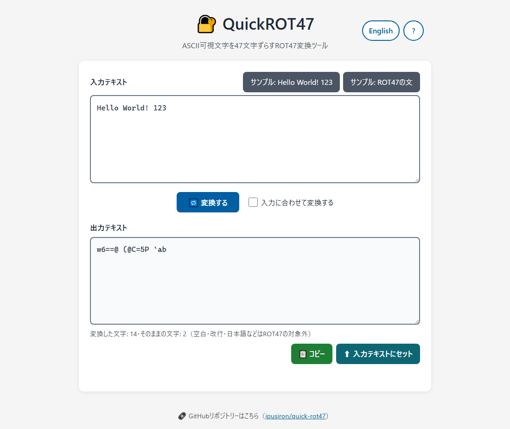
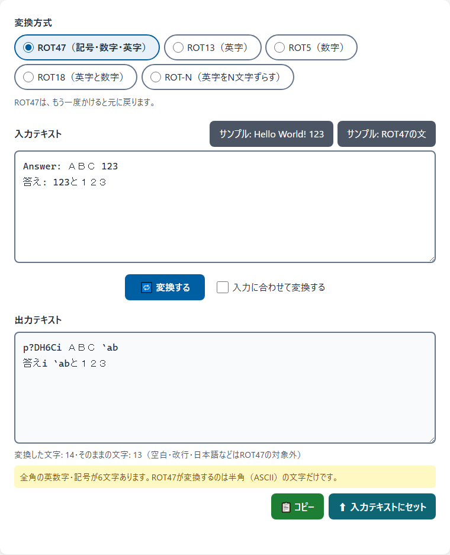

<!--
---
id: day037
slug: quick-rot47

title: "QuickROT47"

subtitle_ja: "ROT47変換ツール"
subtitle_en: "ROT47 Encoder/Decoder"

description_ja: "ASCII可視文字（33〜126）を47文字ずらして置き換える「ROT47」を、その場で試せるシンプルなWebツール"
description_en: "A simple web tool for instantly encoding and decoding text using ROT47 cipher, which shifts ASCII printable characters (33-126) by 47 positions"

category_ja:
  - 現代暗号
  - エンコード/デコード
category_en:
  - Modern Cryptography
  - Encoding/Decoding

difficulty: 1

tags:
  - ROT47
  - cipher
  - encoding
  - decoding
  - ASCII
  - CTF

repo_url: "https://github.com/ipusiron/quick-rot47"
demo_url: "https://ipusiron.github.io/quick-rot47/"

hub: true
---
-->

# QuickROT47 - ROT47変換ツール

[English](README.en.md) · 日本語


[](https://ipusiron.github.io/quick-rot47/)

**Day037 - 生成AIで作るセキュリティツール100**

**QuickROT47**は、ASCII可視文字（33〜126）を47文字ずらして置き換える「ROT47」を、その場で試せるシンプルなWebツールです。

平文とROT47の文の行き来はボタン1つで済みます。同じ変換をもう一度かけると元に戻る仕組みを、手を動かしながら確かめられます。
ROT47には鍵がなく、暗号としての安全性はありません。このツールは、仕組みを学ぶための教材として作っています。

---

## 🔗 デモページ

👉 [https://ipusiron.github.io/quick-rot47/](https://ipusiron.github.io/quick-rot47/)

---

## 📸 スクリーンショット

> 
>
> *「Hello World! 123」をROT47で変換した結果*

> 
>
> *全角の英数字は変換されないので、注意書きが出る*

---

## 🚀 特徴

- ✅ ROT47の変換をボタン1つで実行する（変換した文をもう一度変換すると元に戻る）
- ✅ 「入力に合わせて変換する」をオンにすると、入力するそばから変換する
- ✅ 平文とROT47の文、2種類のサンプルを用意している
- ✅ 変換した文字と、そのまま残った文字（空白・改行・日本語など）の数を表示する
- ✅ 全角の英数字・記号が混ざっていると、変換されないことを知らせる
- ✅ 出力をコピーできる（コピーできない環境では出力を選択し、手動でコピーする方法を案内する）
- ✅ 出力を入力に移して、すぐに変換し直せる
- ✅ 日本語と英語の画面を切り替えられる（画面上部のボタン）
- ✅ 入力した文はどこへも送らない（すべてブラウザーの中で処理する）

---

## 🧭 使い方

1. 入力テキストに文を入れる（サンプルのボタンでも入れられる）
2. 「変換する」を押す
3. 出力をコピーする。「入力テキストにセット」を押すと、出力を入力に移して変換し直す（出力は元の文に戻る）

画面上部の「?」でヘルプを開けます。

---

## 🧪 ROT47とは？

ROT47は、ASCIIの可視文字94文字を47文字ずらして置き換える方法です。
英字だけを扱うROT13と違い、数字や記号も変換します。

置き換えた文に**同じ処理をもう一度かける**と、元の文に戻ります。そのため、変換と復元に同じボタンを使えます。

### 94文字の対応表

上の行と下の行で、同じ列の文字どうしが入れ替わります（たとえば`A`と`p`、`1`と`` ` ``）。

```
!"#$%&'()*+,-./0123456789:;<=>?@ABCDEFGHIJKLMNO
PQRSTUVWXYZ[\]^_`abcdefghijklmnopqrstuvwxyz{|}~
```

### ⚠️ 暗号ではない

ROT47には鍵がありません。仕組みを知っていれば、だれでも同じ変換をかけて元に戻せます。
OWASPは、Base64のようなエンコーディングを「セキュリティ対策（security control）ではない」と位置づけています。ROT47も同じです。

次の使い方は見た目を変えるだけで、情報の保護にはなりません。

- 設定ファイルのパスワードやAPIキーをROT47で隠しても、保護にならない。単純なエンコーディングでパスワードを覆うことは、CWE-261（Weak Encoding for Password）として弱点に分類されている。秘密情報はシークレット管理の仕組みか、鍵を使う暗号化で扱う。
- ログの個人情報をROT47で「マスキング」しても、保護にならない。ROT47が変換するのはASCIIの可視文字だけなので、漢字やかなの氏名はそのまま残る。ログに残すべきでない情報は、記録しないか、削除・マスク・ハッシュ化・暗号化などで扱う（OWASP Logging Cheat Sheet）。
- デバッグ情報をROT47で覆っても、保護にならない。リリース前に取り除く（CWE-215、CWE-532）。

ROT47が役に立つのは、ネタバレ防止のように「うっかり読んでしまわない」程度の目隠しまでです。

---

## 📊 ASCII文字と可視文字・不可視文字

### ASCII文字コード体系

ASCII（American Standard Code for Information Interchange）は、コンピューターで文字を表すための7ビットの文字コード体系です。0〜127の128文字を定義しています。

### 文字の分類

| 分類 | コード範囲 | 文字数 | 内容 | 例 |
|------|------------|--------|------|-----|
| **制御文字（不可視）** | 0〜31 | 32個 | 画面に表示されない制御用の文字 | NUL(0), TAB(9), LF(10), CR(13) |
| **スペース** | 32 | 1個 | 語の区切り。印字できる文字に数えることもあるが、形はない | SP(32) |
| **可視文字** | 33〜126 | 94個 | 画面に表示される文字 | !, ", #, $, %, A, B, 1, 2など |
| **削除文字（不可視）** | 127 | 1個 | 削除の制御文字 | DEL(127) |

### ROT47が対象とする範囲

ROT47が対象とするのは、**ASCII可視文字（33〜126）の94文字**だけです。内訳は次のとおりです。

```
! " # $ % & ' ( ) * + , - . /  ← 記号（33〜47）
0 1 2 3 4 5 6 7 8 9            ← 数字（48〜57）
: ; < = > ? @                  ← 記号（58〜64）
A B C D E F G H I J K L M N O  ← 大文字（65〜79）
P Q R S T U V W X Y Z          ← 大文字（80〜90）
[ \ ] ^ _ `                    ← 記号（91〜96）
a b c d e f g h i j k l m n o  ← 小文字（97〜111）
p q r s t u v w x y z          ← 小文字（112〜122）
{ | } ~                        ← 記号（123〜126）
```

### 可視文字だけを対象にする理由

1. **改行やタブが残る**：改行（LF）やタブ（TAB）などの制御文字は変換しないので、行の区切りや字下げがそのまま残る
2. **ファイルが壊れない**：制御文字を変換すると、ファイルが壊れたり、思わぬ動作を引き起こしたりすることがある
3. **表示できる文字のまま**：変換結果も可視文字だけでできているので、どのエディターでも表示・編集できる

### 具体例

次の2行（2行目の「2」と「Tab」の間はタブ）を変換します。

```
Hello World!
Line 2	Tab
```

ROT47で変換すると、次のようになります。

```
w6==@ (@C=5P
{:?6 a	%23
```

- 改行（1行目と2行目の間）はそのまま残る
- タブ（「2」と「Tab」の間）もそのまま残る
- 変換されるのは可視文字だけである

### 全角文字と日本語

全角の英数字・記号（「Ａ」「１」「！」など）は、ASCIIとは別の文字です。ROT47はこれらを変換しません。
日本語の文字や絵文字も同じく変換しません。

このツールは、全角の英数字・記号が入力に混ざっていると、その数を注意書きで知らせます。
全角の英数字・記号もROT47で変換したい場合は、入力する前に半角に直してください。

---

## 🔄 ROT13とROT47の比較

| 特徴 | ROT13 | ROT47 |
|------|-------|-------|
| **対象文字** | 英字のみ（A〜Z、a〜z） | ASCII可視文字すべて（33〜126） |
| **文字数** | 26文字 | 94文字（記号・数字・英字） |
| **ずらす数** | 13文字 | 47文字 |
| **数字** | ❌ 変換しない | ✅ 変換する |
| **記号** | ❌ 変換しない | ✅ 変換する |
| **大文字と小文字** | 大文字は大文字、小文字は小文字のまま | 保たれない（`A`→`p`、`a`→`2`、`P`→`!`） |
| **日本語・全角文字** | 変換しない | 変換しない |
| **可逆性** | ✅ 2回かけると元に戻る | ✅ 2回かけると元に戻る |

### 変換例

| 入力 | ROT13 | ROT47 |
| --- | --- | --- |
| `` Hello World! 123 `` | `` Uryyb Jbeyq! 123 `` | `` w6==@ (@C=5P `ab `` |
| `` The Quick Brown Fox `` | `` Gur Dhvpx Oebja Sbk `` | `` %96 "F:4< qC@H? u@I `` |
| `` Answer: 42 `` | `` Nafjre: 42 `` | `` p?DH6Ci ca `` |
| `` https://example.com/?q=1 `` | `` uggcf://rknzcyr.pbz/?d=1 `` | `` 9EEADi^^6I2>A=6]4@>^nBl` `` |

ROT13では数字・記号・URLの形が残ります。ROT47では、それらも読めない形に変わります。

### 使い分けのポイント

- **ROT13**：英文だけを扱い、数字や記号、URLの形はそのまま残したい場合
- **ROT47**：数字や記号も含めて、ひと目では読めない形にしたい場合（日本語と全角文字は変わらない）

---

## 🔬 2回かけると元に戻る理由（技術的な解説）

ROT47が2回で元の文字に戻るのは、**47が94のちょうど半分**だからです。

### 数学的な仕組み

ASCII可視文字は94文字（コード33〜126）です。ROT47は、各文字を94文字の輪の上で47文字ずらします。式で書くと次のとおりです。

```
1回目の変換: 文字X → (X - 33 + 47) mod 94 + 33 = Y
2回目の変換: 文字Y → (Y - 33 + 47) mod 94 + 33 = X
```

### 具体例で理解する

文字「A」（ASCIIコード65）を2回変換すると、次のようになります。

```
1回目: 'A' (65)
  先頭（!）からの位置: 65 - 33 = 32
  ずらした位置: (32 + 47) mod 94 = 79
  文字コード: 79 + 33 = 112 -> 'p'

2回目: 'p' (112)
  先頭（!）からの位置: 112 - 33 = 79
  ずらした位置: (79 + 47) mod 94 = 126 mod 94 = 32
  文字コード: 32 + 33 = 65 -> 'A'（元に戻る）
```

### 47である理由

- 94文字の輪で、94 ÷ 2 = 47となる
- 47文字ずらすと、輪の上をちょうど半周する
- 47 × 2 = 94で、94 mod 94 = 0なので元の位置に戻る
- そのため、変換と復元が同じ操作になる（自己逆変換）

### 視覚的イメージ

時計の文字盤を思い浮かべてください。12時から6時へ半周進み、6時から12時へもう半周進むと元の位置に戻ります。ROT47も同じで、94文字の輪を47文字（半周）ずつ2回進むと、ちょうど1周して元の位置に戻ります。

このように、ROT47は**自己逆変換**（involution）です。同じ処理で変換も復元もできます。

---

## 🌍 ROT47の由来と使われ方

### 名前の由来

ROT47という名前が記録に残る最も古い例は、日本のネットニュース（JUNET）のニュースグループfj.kanjiへ1987年7月に投稿された記事です（記事の日付は7月23日、グリニッジ標準時）。
当時の漢字の記事にROT13をかけても、変わるのはJIS漢字のバイトのうち英字の範囲に入るものだけです。そのため、ひらがな・カタカナ・漢字の区別がつき、内容もおおよそ推測できてしまいました。この投稿で東京工業大学の和田俊和氏が、大阪大学の齊藤明紀氏から提案された方法として「ROT47」を紹介しました（所属はいずれも当時）。1バイトの値0x21〜0x7E（94通り）を47ずらす方法です。JIS漢字は2バイトとも0x21〜0x7Eの範囲にあるため、各バイトを47ずらすと、第1水準の漢字の大部分が第2水準の漢字に置き換わり、ひと目では読めなくなります。
その2日後、齊藤氏は自身が手を入れていたニュースリーダーjnews（もとはKenneth Almquistのvnews）にこの変換を組み込みました。その変換式は、現在のROT47と同じです。想定していた用途はROT13と同じく、ジョークやネタバレを隠すことでした。
同年9月には、英字にROT13、JIS漢字にROT47をかける「ROT13/47」が提案されました。この方式は、文字コード変換ツールnkfの`-r`オプションとして今も残っています。
英数字や記号だけの文にROT47をかける現在の使い方がいつ広まったかは、一次資料では確かめられていません。

### ROT13とネタバレ防止の慣習

Usenetでは1980年代初頭から（net.jokesなど）、不快に感じる読者がいそうなジョークや、パズルの答え、ネタバレをROT13で隠す慣習がありました。読み手は、自分で解読を選んだときだけ中身を読めます。
ROT47を同じような目隠しに使うこともできます。ただし、ネタバレ防止の慣習として定着したのはROT13のほうです。
なお、現在のRedditやDiscordには専用のネタバレ表示機能（Redditは`>!…!<`、Discordは`||…||`）があります。

### ジオキャッシング

ジオキャッシングの公式サイト（geocaching.com）では、キャッシュのヒントをROT13で暗号化して表示します。公式用語集にも「Hints for geocaches are encrypted using ROT13」と書かれています。
一方、謎解き型のミステリーキャッシュでは、作成者が出題の一部としてROT47を使うことがあります。たとえばフランスのGC4ZVTF「Crypto #2 - ROT47」は、最終地点の座標をROT47で書いています。ROT47は数字や記号も変換するので、座標のように数字を含む文字列も読めない形にできます。

### CTF（Capture The Flag）

ROT47は、CTFの入門レベルの問題に使われることがあります。たとえばSunshineCTF 2019の「WelcomeCrypto」（Crypto、50点）や、picoCTF 2021の「crackme-py」（Reverse Engineering、30点）です。
英字だけでなく数字や記号も置き換わるため、ROT13の出力よりひと目で読みにくくなります。ただし鍵がないので、仕組みに気づけばすぐに元に戻せます。

### 学習・パズル

- 暗号の基礎（換字・自己逆変換・文字コード）を学ぶ教材になる
- プログラミング演習の題材に向いている（数行で書け、テストしやすい）
- ARG（代替現実ゲーム）や脱出ゲームのヒントにも使える

### 参考資料

- [fj.kanjiの古い記事のアーカイブ](https://ie.u-ryukyu.ac.jp/~kono/fj/fj.kanji/)（琉球大学）：1987年7月〜9月のROT47とROT13/47の議論
- [nkfのマニュアル](https://manpages.ubuntu.com/manpages/jammy/man1/nkf.1.html)：`-r`オプション（ROT13/47）
- [Wikipedia「ROT13」（英語版）](https://en.wikipedia.org/wiki/ROT13)：UsenetでのROT13の使われ方、ROT5・ROT18・ROT47
- [Geocaching Glossary](https://www.geocaching.com/about/glossary.aspx)：ヒントはROT13で暗号化される
- [GC4ZVTF「Crypto #2 - ROT47」](https://www.geocaching.com/geocache/GC4ZVTF_crypto-2-rot47)：ROT47を使ったミステリーキャッシュ
- [SunshineCTF 2019「WelcomeCrypto」のWriteup](https://ctftime.org/writeup/14258)、[picoCTF 2021「crackme-py」のWriteup](https://github.com/evyatar9/Writeups/blob/master/CTFs/2021-picoCTF2021/crackme-py/README.md)
- [OWASP Security Terminology Cheat Sheet](https://cheatsheetseries.owasp.org/cheatsheets/Security_Terminology_Cheat_Sheet.html)、[OWASP Logging Cheat Sheet](https://cheatsheetseries.owasp.org/cheatsheets/Logging_Cheat_Sheet.html)
- [CWE-261: Weak Encoding for Password](https://cwe.mitre.org/data/definitions/261.html)、[CWE-215](https://cwe.mitre.org/data/definitions/215.html)、[CWE-532](https://cwe.mitre.org/data/definitions/532.html)
- [rottytooth/rot8000](https://github.com/rottytooth/rot8000)：ROT8000の参照実装

---

## 🔢 ROT13・ROT47以外の類似方式

### 数字ベースのROT

| 名称 | 対象文字 | ずらす数 | 特徴 |
|------|----------|----------|------|
| **ROT5** | 数字のみ（0〜9） | 5文字 | 10文字の輪を半周するので、2回かけると元に戻る |
| **ROT18** | 英字と数字 | 英字は13文字、数字は5文字 | 英字にROT13、数字にROT5を同時にかける（18＝13＋5）。ROT13.5とも呼ばれる |

### 文字範囲別の換字

| 名称 | 対象範囲 | 特徴 |
|------|----------|------|
| **Atbash（アトバシュ）** | ヘブライ文字・英字 | アルファベットを逆順に対応させる（A↔Z、B↔Y）。もとはヘブライ文字に使われた |
| **シーザー暗号** | 英字 | 各文字を決まった数だけずらす方式の総称（ROTの一般形）。カエサル自身は3文字ずらしを使ったと伝えられる |

### 特殊なROTの変種

1. **ROT8000**
   - ROT13の考え方を、Unicodeの基本多言語面（BMP、U+0000〜U+FFFF）に広げたものである
   - 作者はアーティスト兼プログラマーのDaniel Temkinで、2013年11月にオンラインのデジタルアート・ビエンナーレThe Wrong向けに公開された。名前の「8000」はBMPの半分にあたる0x8000に由来し、公開当初の解説ページの例は、各文字をちょうど0x8000ずらした出力だった
   - 現行の参照実装（rottytooth/rot8000）は、制御文字・空白文字・サロゲートを除いた63,404文字を並べ、その半分の31,702文字だけずらす。そのため、ずらし幅は0x8000より少し小さく、出力も公開当初とは違う
   - どちらも2回かけると元に戻る。現行版では、英文は竹かんむりや米を部首に持つ漢字が並んだような見た目になる。かなはハングルに移り、漢字はハングルや私用領域（表示できないことが多い）などに移ることが多い

2. **ROT-N（可変）**
   - ずらす数を利用者が決める
   - シーザー暗号と同じ考え方である
   - ずらす数を鍵と見なせるが、英字なら候補は25通りしかなく、すべて試せばすぐに解ける

3. **ROT13/47**
   - 英字にROT13、JIS漢字にROT47をかける方式である（「名前の由来」を参照）
   - 文字コード変換ツールnkfの`-r`オプションとして今も残っている

### 比較表

| 方式 | 可逆性 | 安全性 | 実装の難しさ | 主な場面 |
|------|--------|--------|--------------|----------|
| ROT13 | ✅ 自己逆変換 | 極低 | 極めて簡単 | ネタバレ防止 |
| ROT47 | ✅ 自己逆変換 | 極低 | 極めて簡単 | CTFの入門問題・パズル |
| ROT5 | ✅ 自己逆変換 | 極低 | 極めて簡単 | 数字の目隠し |
| Atbash | ✅ 自己逆変換 | 極低 | 簡単 | 古典暗号の学習 |
| シーザー暗号 | ⚠️ 復元にはずらした数が必要 | 低 | 簡単 | 暗号の入門 |
| ROT8000 | ✅ 自己逆変換 | 極低 | やや難しい | 実験・作品 |

### ROT47の立ち位置

1. **ROT13より広い範囲を変換する**
   - 数字と記号も変換する
   - ASCIIの範囲で完結し、数行で実装できる
2. **扱いやすい**
   - 変換結果もASCIIの可視文字なので、文字化けしにくい
   - どのテキストエディターでも扱える
3. **ツールでの扱い**
   - ROT13の派生として知られている。CyberChefなど多くのツールは、ROT13と並べてROT47の変換を備えている
   - ROT13ほどは普及していない。PythonやPHPの標準機能にあるのはROT13だけである

---

## 📂 ディレクトリー構成

```
quick-rot47/
├── .github/                # GitHubの設定
│   └── workflows/          # GitHub Actionsのワークフロー
│       └── test.yml        # pushとpull_requestでnpm testを実行する
├── assets/                 # 画像
│   ├── en/                 # 英語の画面のスクリーンショット
│   │   └── screenshot.png  # 英語の画面でサンプルを変換した結果
│   ├── screenshot.png      # サンプルを変換した結果
│   └── screenshot2.png     # 全角の英数字を含む文の変換と注意書き
├── js/                     # スクリプト（classic script）
│   ├── i18n.js             # 日英の辞書と言語の切り替え
│   ├── main.js             # 変換・サンプル・コピー・ヘルプの画面の動き
│   └── rot-core.js         # ROT47の変換と文字数の集計（DOMを使わない）
├── test/                   # 自動テスト（node --test）
│   ├── contrast.test.js    # 配色のコントラスト比
│   ├── core.test.js        # 手で確かめた変換例・自己逆変換・集計
│   ├── format.test.js      # 行の長さ・制御文字・行数
│   ├── html.test.js        # CSP・ARIA・使わない書き方（innerHTMLなど）
│   ├── i18n.test.js        # 日英の辞書
│   └── readme.test.js      # READMEの変換例・構成・画像
├── .gitignore              # Gitの管理から外すファイル
├── .nojekyll               # GitHub PagesでJekyllを使わない
├── CLAUDE.md               # Claude Code向けの説明（英語）
├── LICENSE                 # MITライセンス
├── README.en.md            # 英語の説明
├── README.md               # 日本語の説明
├── index.html              # 画面
├── package.json            # npm testの設定（依存なし）
└── style.css               # 画面のスタイル（配色は:rootの変数）
```

---

## ⚙️ ツールの仕様

### 画面

| 要素 | 説明 |
|------|------|
| **入力テキスト** | 複数行の入力欄。サンプルのボタンで平文かROT47の文を入れられる |
| **変換する** | 入力をROT47で変換して出力に入れる |
| **入力に合わせて変換する** | オンにすると、入力するそばから変換する |
| **出力テキスト** | 変換結果（読み取り専用）。下に変換した文字とそのまま残った文字の数を表示する |
| **コピー** | 出力をクリップボードにコピーする。コピーできないときは出力を選択し、手動でコピーする方法を案内する |
| **入力テキストにセット** | 出力を入力に移して、すぐに変換し直す（出力は元の文に戻る） |
| **状態表示** | 操作の結果を4秒間表示する（スクリーンリーダーにも読み上げられる） |
| **ヘルプ（?）** | ROT47の仕組み・使い方・注意点を表示する |
| **言語の切り替え** | 日本語と英語を切り替える。選んだ言語はブラウザーに保存する |

### 技術

| 項目 | 詳細 |
|------|------|
| **フロントエンド** | HTML、CSS、JavaScript（ライブラリーなし・ビルドなし） |
| **スクリプト** | classic script。変換の中核（`js/rot-core.js`）はDOMを使わず、Node.jsのテストからも読み込める |
| **CSP** | `default-src 'none'`を基本に、このページ自身のスクリプト・スタイル・画像（ファビコンのdata:を含む）だけを許可する。外部への通信はしない |
| **クリップボード** | `navigator.clipboard.writeText`を使う。コピーできないときは出力を選択し、手動でコピーする方法を案内する |
| **保存するもの** | 表示言語だけ（`localStorage`）。保存できない環境でも動く |
| **言語の決め方** | URLの`?lang=ja`・`?lang=en`、保存した言語、ブラウザーの言語の順 |
| **レスポンシブ** | 640px以下と480px以下で余白と配置を調整する。ボタンの高さは44px以上 |
| **テスト** | `npm test`（`node --test`）。依存パッケージなし |

### 配色

| 要素 | 色 |
|------|----|
| メインカラー（変換ボタン・ヘッダーのボタン・ヘルプの見出し・リンク） | `#005fa3`（`--primary`） |
| 変換ボタンのホバー | `#004a80`（`--primary-dark`） |
| コピーボタンと状態表示の文字 | `#1e7e34`（`--ok`） |
| 「入力テキストにセット」ボタン | `#0e6674`（`--set`） |
| サンプルのボタン | `#4b5563`（`--sample`） |
| 本文の文字 | `#1f2937`（`--text`） |
| 補足の文字（副題・文字数の表示・フッター） | `#4b5563`（`--muted`） |
| 注意書きの文字（全角文字の注意） | `#854d0e`（`--warn-text`） |
| キーボードで選んだ部品の枠線（フォーカス表示） | `#005fa3`（`--focus`） |

どの文字色も、背景とのコントラスト比4.5:1以上です（`test/contrast.test.js`で確かめています）。

---

## 🧪 テスト

```bash
npm test
```

次の点を確かめます。GitHub Actionsでも、pushとpull requestのたびに実行します。

- ROT47の変換結果が、手で確かめた例と一致すること
- 94文字の対応が自己逆変換になっていること
- 画面の文言が日英でそろっていること
- CSPが厳しいままで、`innerHTML`やインラインのスクリプトなどを使っていないこと
- 配色のコントラスト比
- READMEの変換例・対応表・計算例が、変換の中核と一致すること

---

## 📚 関連するリソース

### ツール（私が関与したもの）

- [ROT13 Encoder](https://ipusiron.github.io/rot13-encoder/)

---

## 📄 ライセンス

MIT License - 詳細は[LICENSE](LICENSE)をご覧ください。

---

## 🛠 このツールについて

本ツールは、「生成AIで作るセキュリティツール100」プロジェクトの一環として開発されました。このプロジェクトでは、AIの支援を活用しながら、セキュリティに関連するさまざまなツールを100日間にわたり制作・公開していく取り組みを行っています。

プロジェクトの詳細や他のツールについては、以下のページをご覧ください。

🔗 [https://akademeia.info/?page_id=42163](https://akademeia.info/?page_id=42163)
